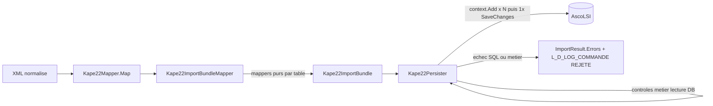

# Architecture Spine — Kape22Importer — Dispatch aval L_D_KAPE22

## Design Paradigm

**Pipeline de mappers purs convergeant vers un unique point d'E/S transactionnel**,
extension directe du paradigme déjà en place pour `L_D_KAPE22` (Épic 2, Story 2.8) :

- **Mappers** (`*Mapper.cs`, namespace `Kape22Importer`) : fonctions pures,
  aucune I/O, aucune dépendance EF/DB. Chacune connaît **une seule** table
  cible et ses colonnes explicitement — aucune boucle sur `PropertyInfo`,
  aucune table de correspondance générique parcourue par réflexion.
- **Orchestrateur de mapping** (`Kape22ImportBundleMapper`, nouveau) : compose
  `Kape22Mapper.Map` + les mappers par table + les règles métier qui ne lisent
  pas la base, et produit un `Kape22ImportBundle` unique.
- **Persister** (`Kape22Persister`, étendu) : **seul** point d'E/S. Il porte le
  contexte EF, exécute les contrôles métier qui nécessitent une lecture base
  (existence de la coulée), empile (`context.Add`) toutes les entités du
  bundle, puis appelle **un seul** `SaveChanges()`. C'est ce `SaveChanges()`
  unique — pas un `TransactionScope` explicite — qui porte l'atomicité
  (comportement EF Core déjà en vigueur en Story 2.8, inchangé dans sa nature).



## Invariants & Rules

### AD-1 — Transaction unique étendue (aucun état intermédiaire committé)

- **Binds:** FR-11, tout le dispatch aval, NFR-7.
- **Prevents:** un `L_D_KAPE22` commité sans ses tables aval en cas d'échec du
  dispatch — ce qui rendrait la ligne invisible au garde-fou anti-doublon
  (`AC-FR11-6/7`) et empêcherait tout rejeu du Fichier corrigé (NFR-7).
- **Rule:** `L_D_KAPE22`, `L_D_LOG_COMMANDE`, `L_D_ORDRE_FABRICATION`,
  `L_D_COULEE`, `L_D_CONSIGNES` et les `L_D_SECTIONCHARGE_*` concernées sont
  ajoutées au **même** `DbContext` et committées par **un seul**
  `SaveChanges()`. Aucune écriture partielle : soit tout commit, soit rien.

### AD-2 — Mapping explicite, sans réflexion

- **Binds:** tout mapper de ce dispatch.
- **Prevents:** la ré-introduction du `MappingTemplate` générique + parcours
  `PropertyInfo` (legacy `KAPE22Controller._ConvertKAPE22toOrdreFabrication`),
  illisible et informaintenable.
- **Rule:** un mapper par table cible, propriétés lues/écrites par leur nom
  explicite dans le code C#. Aucun `System.Reflection`, aucune
  `Activator.CreateInstance`, aucune table de mapping interprétée à
  l'exécution dans le nouveau code.

### AD-3 — Mur d'étanchéité avec l'application legacy

- **Binds:** tout le dispatch aval, le worker `Kape22Importer`.
- **Prevents:** un couplage runtime avec `Ascometal.LSI.DAL`/`BLL`, ou une
  régression accidentelle de l'application legacy pendant sa période de
  cohabitation puis de débranchement.
- **Rule:** le code legacy (`Ascometal.LSI.*`) est une référence de lecture
  seule pour comprendre l'intention métier. Il n'est **jamais modifié**,
  **jamais référencé en assembly**, **jamais appelé à l'exécution** par
  `Kape22Importer`. Les nouvelles entités EF sont **redéfinies** dans
  `Kape22Importer.Persistence`, indépendamment des classes `EntityObject`
  legacy.

### AD-4 — Cause d'échec identifiée et journalisée (double journal existant)

- **Binds:** tout échec du dispatch (SQL ou métier).
- **Prevents:** un rejet silencieux ou un message générique qui n'oriente pas
  l'exploitant.
- **Rule:** tout échec — SQL (`DbUpdateException`/`DbException`) ou métier
  (coulée introuvable, répartition lingots/fours incohérente, section de
  charge manquante) — devient un `ConversionError{Block:File, Code}` distinct
  et rejoint le circuit existant : `L_D_LOG_COMMANDE` (`"<NumeroFichier> —
  REJETÉ : <cause>"`, AC-FR11-4) + `MQTTnetServices.Logs` (FR-14/Story 3.3) +
  déplacement du Fichier en `error/` (FR-12). Pas de nouveau canal de
  journalisation.

### AD-5 — Persistance database-first, sans migration

- **Binds:** les 10 nouvelles entités (OF, Coulée, Consignes, 7×SectionCharge).
- **Prevents:** une dérive schéma code ⟷ base réelle (répète le risque R-3
  déjà réglé pour `L_D_KAPE22`).
- **Rule:** chaque entité est ajoutée à `AscoLsiDbContext` d'après le schéma
  réel `AFV004-LSI` (via `sys.columns`, jamais rédigée de mémoire), un fichier
  par entité sous `Persistence/`, aucune migration EF générée, `Id` identity
  quand la table en a un. `scripts/schema/` reçoit les scripts idempotents
  correspondants pour que les tests d'intégration (AR-12) les couvrent.

### AD-6 — `Kape22ImportBundle` porte les métadonnées de `MapResult`, le `Persister` est étendu (pas dupliqué)

- **Binds:** `Kape22ImportBundleMapper`, `Kape22Persister`, `Kape22FichierProcessor` (Story 3.2).
- **Prevents:** deux chemins de persistance divergents (un ancien `Persist(MapResult<L_D_KAPE22>)`
  encore appelé quelque part, un nouveau `Persist(Kape22ImportBundle)` ailleurs) qui feraient
  perdre à l'un des deux les garanties de l'autre (garde-fou anti-doublon, rejet AC-FR11-4).
- **Rule:** `Kape22ImportBundle` porte les **mêmes** métadonnées que `MapResult<L_D_KAPE22>`
  (`Success`, `Errors`, `Warnings`, `NumeroFichier`, `OF`) en plus des 9 entités avales
  nullables (`OrdreFabrication`, `Coulee`, les 7 `SectionCharge*`) et de la liste `Consignes`
  (non nullable, `List<L_D_CONSIGNES>`) — 10 entités avales au total depuis la Story 4.5.
  `Kape22Persister.Persist` est **remplacé** par une seule surface acceptant le
  bundle (l'ancien appel `Persist(MapResult<L_D_KAPE22>)` disparaît, `Kape22FichierProcessor`
  est mis à jour dans la même story) — aucune deuxième méthode `Persist` gardée en parallèle.

### AD-7 — Liaisons inter-tables par FK explicite, pas par graphe de navigation EF

- **Binds:** tous les mappers du bundle, `L_D_CONSIGNES`, les 7 `L_D_SECTIONCHARGE_*`.
- **Prevents:** un mapper qui peuple un graphe d'entités liées par propriétés de navigation EF
  (`AddRef`, façon legacy) pendant qu'un autre assigne des colonnes de clé étrangère brutes —
  deux formes incompatibles pour la même relation, qui cohabiteraient mal dans le même
  `SaveChanges()`.
- **Rule:** chaque entité du bundle porte sa clé métier explicite en colonne scalaire (`OF`
  pour `L_D_ORDRE_FABRICATION`/les `L_D_SECTIONCHARGE_*`, la clé de la section de charge
  propriétaire pour ses `L_D_CONSIGNES` associées). Les mappers assignent ces colonnes
  directement ; **aucune** propriété de navigation EF (`ICollection<T>`, référence
  paresseuse) n'est utilisée pour relier les entités du bundle entre elles.

## Consistency Conventions

| Concern | Convention |
| --- | --- |
| Nommage des mappers | `<NomTableSansPrefixe>Mapper` (ex. `OrdreFabricationMapper`, `CouleeMapper`, `SectionChargeChutageMapper`), miroir de `Kape22Mapper` |
| Nommage des entités EF | Nom de table à l'identique (ex. `L_D_ORDRE_FABRICATION`), miroir de `L_D_KAPE22.cs` |
| Erreurs | `ConversionError{Block:File, Code, Message}` ; nouveaux `ErrorCode` ajoutés à l'enum existante, vocabulaire du glossaire PRD §3 (CC-5) |
| Transaction | Un seul `SaveChanges()` par Fichier réussi ; aucun `TransactionScope` explicite ajouté |
| Commentaires code | Anglais, une ligne au-dessus du bloc, jamais en fin de ligne (CC-2/CC-3, inchangé) |
| Ordre alphabétique | Propriétés des nouvelles entités/records par ordre alphabétique (CC-4, inchangé) |
| Secrets/config | Chaînes de connexion via `IConfiguration` uniquement (CC-7, inchangé) |

## Stack

| Name | Version |
| --- | --- |
| .NET | 10.0 (inchangé, AR-2) |
| Microsoft.EntityFrameworkCore | 10.0.x (inchangé, NFR-8) |
| xUnit + `[Trait("Category", ...)]` | inchangé (AR-12) |

Aucune nouvelle dépendance : ce dispatch se code avec ce que
`Kape22Importer` référence déjà (`TextToXml`, `PortalSharedLibrary`, EF Core).

## Structural Seed

```text
src/Kape22Importer/
  Kape22Mapper.cs                          # inchangé : XML normalise -> L_D_KAPE22
  Kape22ImportBundleMapper.cs              # nouveau : orchestre les mappers ci-dessous -> Kape22ImportBundle
  Kape22ImportBundle.cs                    # nouveau : record portant L_D_KAPE22 + les 9 entites avales (nullable si non concernees)
  OrdreFabricationMapper.cs                # nouveau : L_D_KAPE22 -> L_D_ORDRE_FABRICATION (explicite)
  CouleeMapper.cs                          # nouveau : L_D_KAPE22 -> L_D_COULEE (explicite)
  ConsignesMapper.cs                       # nouveau : regles de consignes generales -> L_D_CONSIGNES[]
  SectionCharge/
    SectionChargeChutageMapper.cs          # nouveau, un mapper explicite par outil
    SectionChargeLingotMapper.cs
    SectionChargeDecoupeMapper.cs
    SectionChargePitsMapper.cs
    SectionChargePoidsMetriqueMapper.cs
    SectionChargeRefroidissoirsMapper.cs
    SectionChargeSvtMapper.cs
  Persistence/
    Kape22Persister.cs                     # etendu : accepte Kape22ImportBundle, controles metier + N x Add + 1x SaveChanges
    L_D_KAPE22.cs                          # inchangee
    L_D_ORDRE_FABRICATION.cs               # nouveau, database-first
    L_D_COULEE.cs                          # nouveau, database-first
    L_D_CONSIGNES.cs                       # nouveau, database-first
    L_D_SECTIONCHARGE_CHUTAGE.cs           # nouveau, database-first (x7, un fichier par table)
    ...
    AscoLsiDbContext.cs                    # etendu : DbSet par nouvelle entite
scripts/schema/
  01-ascolsi-tables.sql                    # etendu : CREATE TABLE pour les 10 nouvelles tables (genere depuis AFV004-LSI)
```

## Capability → Architecture Map

| Capability / Area | Lives in | Governed by |
| --- | --- | --- |
| Mapping L_D_KAPE22 → OF/Coulée/Consignes/SectionCharge_* | `src/Kape22Importer/*Mapper.cs`, `SectionCharge/` | AD-2, Consistency: nommage mappers |
| Contrôles métier bloquants (coulée, répartition lingots) | `Kape22Persister` (lecture DB avant `Add`) | AD-1, AD-4 |
| Persistance transactionnelle du bundle complet | `Kape22Persister.Persist(Kape22ImportBundle)` | AD-1, AD-5 |
| Journalisation d'échec (cause précise, exploitant averti) | `Kape22Persister` + `L_D_LOG_COMMANDE` + `MQTTnetServices.Logs` | AD-4 (réutilise FR-14/Story 3.3) |
| Étanchéité avec l'application legacy | tout le dispatch | AD-3 |

## Deferred

- **Extraction du mapping colonne-par-colonne** (annexe équivalente à
  l'Annexe B/C du PRD, depuis le `MappingTemplate` XML legacy) — première
  story de l'épic issu de ce spine ; ce spine fixe la forme (un mapper par
  table, bundle explicite), pas le détail champ-à-champ.
- **Règle d'applicabilité par OF de chaque `L_D_SECTIONCHARGE_*`** (quel outil
  concerne quel OF — le legacy semble ne pas toujours peupler les 7 tables)
  — à documenter dans la même story d'extraction du mapping ; ce spine ne
  fige que la nullabilité au niveau du bundle (AD-1/Structural Seed), pas la
  condition métier qui la pilote.
- **Liste exhaustive des colonnes** de `L_D_ORDRE_FABRICATION`, `L_D_COULEE`,
  `L_D_CONSIGNES` et des 7 `L_D_SECTIONCHARGE_*` — à dériver de `AFV004-LSI`
  (`sys.columns`) comme pour `L_D_KAPE22` (R-3), pas rédigée de mémoire.
- **Débranchement effectif de l'application legacy** (bascule de prod,
  désactivation d'`ImportGPAO`) — hors périmètre technique de ce spine,
  décision opérationnelle du donneur d'ordre au moment du go-live.
- **Écrans/traitements applicatifs legacy consommant ces tables en aval**
  (planning ENC, fours, etc.) — non modifiés, non déplacés ; ce spine ne
  gouverne que l'écriture initiale par le worker.
- **Nouveau `ErrorCode` précis par cause métier** — nommage figé au moment de
  la story de mapping, une fois les règles legacy portées une à une.
